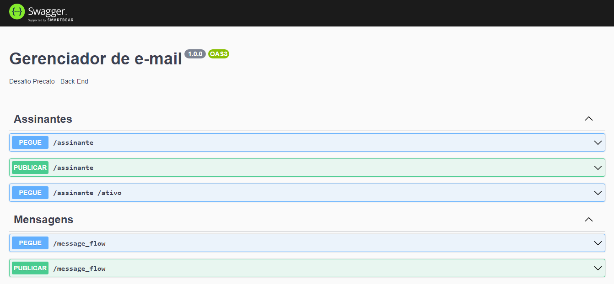

E-mail Menager ✔  

> Descrição:
Projeto destinado ao desenvolvimento de uma API responsável por controlar os registros de clientes em uma base de dados, assim como registros de templates de e-mails relacionados ao envio periódico de e-mails aos clientes da base.

- [x] - Rota de criação de Inscritos com [name] e [e-mail].
- [x] - Rota de visualização dos Inscritos na base de dados.
- [x] - Rota de criação de template de e-mail com [template_name] e [position].
- [x] - Rota de visualização de todos os templates.
- [x] - Rota de visualização dos Inscritos que estão ativos [active].

**IMPORTANT** - É possível testar todas as rotas por meio do localhost:3300/docs onde se encontra a página do SwaggerUI.

 

> API ainda conta com uma rotina diária de atualização das mensagens que devem ser enviadas a seguir para os inscritos;

O projeto foi criado em:

- [x] - NodeJs
- [x] - Banco de dados [PostgreSQL]

## 🤝 Colaboradores

Pessoa que contribuiu para este projeto:

<table>
  <tr>
    <td align="center">
      <a href="https://kain-prog.github.io/kain">
         
        
          <b>Matheus Santos [Kain Developer]</b>
        
      </a>
    </td>
  </tr>
</table>
